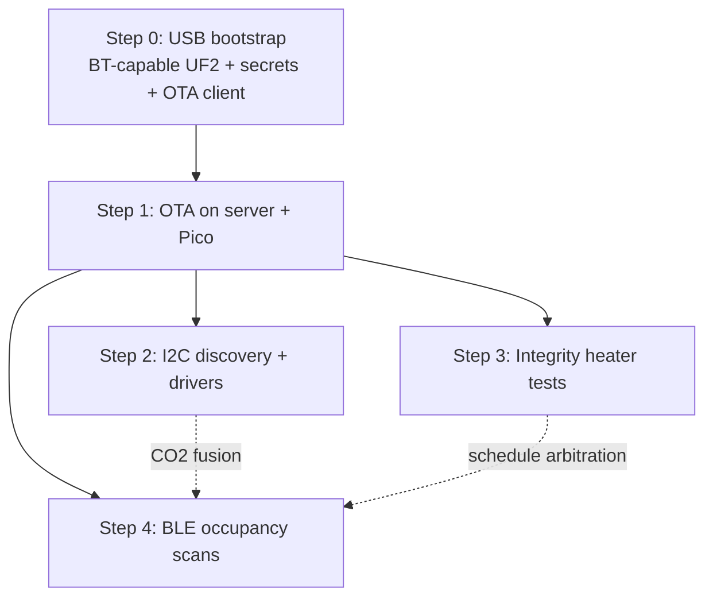

# Development Roadmap

This document describes how the plant-sensor-server architecture scales to new features, how we deploy experimental work alongside production, and phased plans for upcoming capabilities.

For current behavior and setup, see [README.md](../README.md).

## Implementation order (OTA-first)

**Goal:** Build the full project (OTA, sensor discovery, integrity testing, BLE occupancy) so that **after one USB bootstrap per Pico**, all application code, drivers, and libraries update over WiFi. Only the items in the [USB-once checklist](#usb-once-checklist-per-pico) require a physical cable.

### Master sequence

Do these in order. Later features may be **prototyped in the lab** in parallel, but **field rollout** of each feature depends on the rows above it.

| Step | What | Branch (typical) | Field rollout requires | Updates after bootstrap |
|------|------|------------------|------------------------|-------------------------|
| **0** | [USB bootstrap](#usb-once-checklist-per-pico) on every new Pico | — | — | — (one-time USB) |
| **1** | **WiFi OTA** — manifest, updater, modular `main.py` | `feature/pico-ota` | Step 0 on each node | Server + Pico app via OTA |
| **2** | **I2C sensor identification** — scan, drivers, registry | `feature/i2c-sensor-discovery` | Step 1 | `sensors/`, `lib/` via OTA |
| **3** | **Measurement integrity** — GPIO heater, impulse / PRBS | `feature/measurement-integrity` | Step 1 (Step 2 for multi-sensor scoring) | `integrity/` via OTA |
| **4** | **BLE occupancy** — presence sensing, event / heat-load hints | `feature/ble-occupancy` | Step 1; BT-capable UF2 from Step 0 | `ble/`, `lib/aioble/` via OTA |



**Step 1 is the gate.** Until OTA works, every Pico change is a USB visit. Implement and merge OTA before rolling any later feature to field nodes.

**Step 0 is the insurance policy.** Choices made at first USB flash (especially the MicroPython UF2) cannot be fixed over OTA. Get Step 0 right on every node you deploy today, even while still running the current AHT20-only `main.py`.

### USB-once checklist (per Pico)

Complete these **once per board** at provisioning (lab or field). After this, prefer WiFi OTA for all application changes.

| # | Action | Why it cannot be OTA’d later |
|---|--------|------------------------------|
| 1 | Flash **Bluetooth-capable** [RPI_PICO_W MicroPython UF2](https://micropython.org/download/RPI_PICO_W/) | Runtime firmware is USB/BOOTSEL only |
| 2 | Verify `import bluetooth` and `import network` in REPL | Confirms correct UF2 before sealing enclosure |
| 3 | Copy `secrets.py` (from `secrets_template.py`) | WiFi credentials; never overwritten by OTA |
| 4 | Copy **`urequests`** (and any other bundled deps) to `lib/` if not in firmware | HTTP for submit + OTA download |
| 5 | Install **OTA-capable bootstrap** — first `main.py` + `update.py` (Feature 1) with modular layout | Last mandatory USB if done before sealing; enables all future updates |
| 6 | Optional: pre-load `lib/aioble/`, empty `sensors/`, `integrity/`, `ble/` stubs | Saves first OTA round-trip; not required if OTA works |
| 7 | Set `NODE_ID`, `SERVER_URL`, initial `FIRMWARE_VERSION` | `secrets.py` / config; URL can move to remote config later |
| 8 | Record `node_id` + commissioned `firmware_version` on server | Traceability for manifest targeting |

**Do not USB-flash a non-Bluetooth UF2** on nodes intended for the full roadmap — Feature 4 would require recalling every board.

### OTA-updatable (everything else)

After Step 1 works, ship these over WiFi via manifest (hash-verified, never touch `secrets.py`):

| Path on Pico | Contents |
|--------------|----------|
| `main.py` | Main loop, scheduling, radio time-slicing |
| `update.py` | OTA client (keep stable; update cautiously) |
| `boot.py` | Optional rollback after bad OTA |
| `i2c_bus.py`, `discovery.py` | Feature 2 |
| `sensors/*.py` | Per-board drivers (AHT20, SCD41, …) |
| `integrity/*.py` | Feature 3 heater + scoring |
| `ble/*.py` | Feature 4 scan + occupancy model |
| `lib/**` | `aioble`, vendored micropython-lib, shared helpers |

Server hosts release artifacts under `firmware/releases/<version>/` with a manifest listing every file, SHA-256, and size. See [Feature 1](#feature-1-wifi-ota-application-updates).

### Target Pico filesystem (end state)

Evolve toward this layout during Step 1 so OTA never requires restructuring:

```
pico/
├── boot.py              # optional rollback
├── main.py              # state machine: SENSOR | BLE_SCAN | INTEGRITY | OTA | WIFI_POST
├── update.py            # OTA client
├── secrets.py           # USB only — not in manifest
├── schedule.py          # arbitrates timed activities (Feature 3 + 4)
├── i2c_bus.py           # Feature 2
├── discovery.py         # Feature 2
├── sensors/             # Feature 2 — OTA
├── integrity/           # Feature 3 — OTA
├── ble/                 # Feature 4 — OTA
└── lib/                 # urequests, aioble, … — OTA
```

**Main-loop rule (from Step 1 onward):** implement explicit **phases** rather than a single monolithic loop. Later features add phases (`INTEGRITY`, `BLE_SCAN`) and `schedule.py` coordinates them. Retrofitting this after field deploy is painful; build it into the Feature 1 refactor.

### Host server order

| Step | Server work |
|------|-------------|
| 0 | Run current `app.py` on `:5000` (production) |
| 1 | Add manifest + `/api/firmware/*`; deploy on `:5001` until merged; then production |
| 2 | Accept `attached_sensors`; driver registry; build manifests from registry |
| 3 | Display integrity metrics on `/check` |
| 4 | Store occupancy fields; optional CO₂ + BLE fusion rules |

Use **git worktrees** to run production (`main`, port 5000) and feature branches (port 5001) side by side while field nodes stay on production.

### Lab vs field policy

| Environment | Policy |
|-------------|--------|
| **Lab / test Pico** | Point at `:5001`; run feature branches; OK to USB-flash frequently |
| **Field nodes** | Stay on production `:5000` until Step 1 OTA is merged and tested; then receive OTA manifests only |
| **New field nodes** | Complete [USB-once checklist](#usb-once-checklist-per-pico) with OTA bootstrap before install |

### What never ships via OTA

- MicroPython **UF2 runtime** (use USB + BOOTSEL)
- **`secrets.py`** (WiFi password)
- Hardware you haven't wired yet (heater, new I2C board) — software can arrive OTA, but physical install is still manual

---

## Core architecture

```
┌─────────────────┐     WiFi / HTTP    ┌──────────────────────────────┐
│  Raspberry Pi   │◀────────────────▶│  Host server (Flask)         │
│  Pico W         │   POST /api/     │  Ingest, store, coordinate   │
│  + I2C sensors  │   submit + GET   │  Optional: OTA, config, UI   │
└─────────────────┘                    └──────────────────────────────┘
```

The Pico W is an **edge client**: it reads sensors, reports JSON to the server, and optionally pulls configuration or firmware updates. The host is the **coordination point**: logging, dashboards, alerting, release artifacts, and per-node desired state.

This pattern supports most future work without redesign:

| Extension point | Purpose |
|-----------------|---------|
| `readings` (JSON object) | Add new sensor values without breaking older nodes |
| `integrity` (JSON object) | Health, faults, calibration state, data quality |
| `firmware_version` | Capability negotiation between Pico and server |
| `POST /api/submit` response | Push hints: updates, config changes, commands |
| New `GET` endpoints | Manifests, per-node config, calibration data |
| Server-only features | Dashboards, CSV tools, alerts — no Pico change required |

### Two ways to change Pico behavior

| Change type | Mechanism | Examples |
|-------------|-----------|----------|
| **Remote config** | JSON in submit response or `GET /api/node/<id>/config` | Read interval, alert thresholds |
| **Application code** | OTA file download (see Feature 1) | New drivers, sensor libraries, bug fixes |
| **Server-only** | Flask changes | `/check` UI, notifications, analytics |
| **One-time / risky** | USB flash | MicroPython UF2 runtime, `secrets.py`, first OTA bootstrap |

See [Implementation order (OTA-first)](#implementation-order-ota-first) for the full sequence and USB-once checklist.

As features accumulate, expect the Flask app to split into modules (blueprints) such as `ingest`, `firmware`, `config`, and `admin`. Pico firmware should follow the [target filesystem layout](#target-pico-filesystem-end-state) so OTA can update pieces independently.

---

## Deployment model (production + experiments)

Field nodes must keep running while new features are developed. Use this workflow:

```
Production (main)              Experiment (feature branch)
─────────────────────          ────────────────────────────
branch: main                   branch: feature/<name>
port:   5000                   port:   5001 (or path prefix)
nodes:  all field Picos        nodes:  lab / test Picos only
```

**Git worktree** (recommended on the host):

```bash
# Primary checkout — production
cd plant-sensor-server
git checkout main

# Second checkout — feature work, same repo
git worktree add ../plant-sensor-ota feature/pico-ota
```

Run two server processes on different ports until a feature is proven, then merge to `main`. Field Picos keep `SERVER_URL` pointing at production until deliberately migrated.

### Branch naming

| Feature | Suggested branch |
|---------|------------------|
| OTA updates | `feature/pico-ota` |
| I2C sensor identification | `feature/i2c-sensor-discovery` |
| Measurement integrity | `feature/measurement-integrity` |
| BLE occupancy estimation | `feature/ble-occupancy` |

---

## Feature 1: WiFi OTA (application updates) — Step 1

**Branch:** `feature/pico-ota`  
**Status:** Planned — not started — **implement before field rollout of Features 2–4**  
**Scope:** Update `.py` files on the Pico filesystem over WiFi. Does **not** include reflashing the MicroPython UF2 runtime (USB only for that).

### Why this is feasible

The Pico W already has WiFi, HTTP (`urequests`), and reports `firmware_version` in every submit payload. The server can serve versioned artifacts and the Pico can download, verify, swap, and reboot.

### Server changes (OTA branch)

New endpoints:

| Endpoint | Purpose |
|----------|---------|
| `GET /api/firmware/manifest` | Version, file list, SHA-256 hashes, sizes |
| `GET /api/firmware/<filename>` | Serve `main.py` and other modules |

Optional extension to existing ingest:

| Change | Purpose |
|--------|---------|
| `POST /api/submit` response | Include `update_available` and manifest URL when `firmware_version` is behind |

Release artifacts stored under something like:

```
firmware/releases/pico-aht20-0.3/
├── manifest.json
├── main.py
├── discovery.py
├── sensors/
│   ├── __init__.py
│   ├── aht20.py
│   └── scd4x.py
└── lib/                    # optional third-party / shared MicroPython modules
    └── ...
```

The manifest lists **every file** in the release (application code, `sensors/` drivers, and `lib/` dependencies) with path, SHA-256, and size. The Pico updater installs each file to the matching path on the filesystem.

### Pico changes

Refactor the main loop to support an update cycle:

1. Connect WiFi.
2. Check manifest (dedicated GET or hint from submit response).
3. If server version > `FIRMWARE_VERSION`: download each file to a temp path (e.g. `main.py.new`).
4. Verify SHA-256 and size.
5. Backup current file → `main.py.bak`.
6. Atomically replace, then `machine.reset()`.

Optional `boot.py` for rollback if the new code fails immediately after reboot.

### Safety rules

- **Never overwrite `secrets.py`** via OTA.
- **Verify before swap** — hash + size at minimum.
- **Download to temp, then rename** — avoid half-written files on power loss.
- **Keep `main.py.bak`** for manual or automatic rollback.
- **Bootstrap problem:** the first OTA-aware firmware must reach each Pico **once via USB** ([USB-once checklist](#usb-once-checklist-per-pico), items 5–7). After that, updates are over WiFi.
- **Bluetooth-ready UF2 (Step 0):** flash a **Bluetooth-capable** MicroPython build at bootstrap even before BLE software exists — see [Step 0](#usb-once-checklist-per-pico).
- **Modular main loop:** refactor to explicit phases (`SENSOR`, `WIFI_POST`, later `OTA`, `INTEGRITY`, `BLE_SCAN`) per [target filesystem](#target-pico-filesystem-end-state).

### Rollout phases

| Phase | Work | Field impact |
|-------|------|--------------|
| 0 | Create branch; deploy OTA server on `:5001` | None |
| 1 | Server manifest + file serving only | None |
| 2 | Pico update client on lab device (USB bootstrap once) | None |
| 3 | Test publish `0.3` → lab Pico updates without USB | None |
| 4 | USB-bootstrap field Picos when convenient | One-time USB per node |
| 5 | Merge to `main` or enable OTA on production port | Controlled migration |

### Out of scope

- Full MicroPython UF2 OTA over WiFi (high brick risk).
- Updating WiFi credentials over OTA (stay in `secrets.py`, USB-managed).

---

## Feature 2: I2C sensor identification — Step 2

**Branch:** `feature/i2c-sensor-discovery`  
**Status:** Planned — lab work can start early; **field rollout requires Step 1 (OTA)**  
**Design decisions:** [SENSOR_DISCOVERY.md](SENSOR_DISCOVERY.md) (rescan interval, starter bundle, CSV/API shape, same-address policy)  
**Scope:** Detect which Adafruit (and compatible) sensor boards are attached on the I2C bus, report capabilities to the server, and read from supported drivers dynamically.

Today, `pico/main.py` hardcodes a single **AHT20** at address `0x38` on GP4/GP5. Future nodes may carry different or multiple boards: higher-resolution temperature, VOC, CO2, particulate matter, etc.

### Goals

1. **Scan the I2C bus** at boot (and optionally periodically) for device addresses.
2. **Identify boards** using address + probe reads (chip ID registers) where possible.
3. **Report inventory** to the server so `/check` and logs show what each node actually has attached.
4. **Load the right driver** per identified device and merge all readings into the existing `readings` payload.
5. **Graceful degradation** — unknown address → log/report as `unknown`; known address but read failure → `integrity` fault, not a crash.

### Why OTA comes first

New sensor drivers and their supporting libraries ship as files under `sensors/` and `lib/`. **Lab development** can use USB copy; **field rollout** of new boards requires Step 1 OTA — see [Implementation order](#implementation-order-ota-first).

### Driver libraries: pre-load and OTA update

We will not rely on CircuitPython bundles or `mip` alone for field nodes. Each supported board needs a **MicroPython driver** (our own minimal port or vendored from [micropython-lib](https://github.com/micropython/micropython-lib)). Those modules reach the Pico in two ways:

| Method | When | What |
|--------|------|------|
| **USB pre-load** | Initial flash, new hardware in the lab, or recovery | Copy `main.py`, `sensors/`, `lib/`, and `secrets.py` via Thonny / `mpremote` |
| **OTA update** | Field rollout after Step 1 | Server manifest delivers new or changed files under `sensors/` and `lib/` |

**Pre-load (bootstrap):** When a node is first provisioned, install the full known driver set (or a “starter bundle” for the boards expected on that node). Flash is cheap relative to RAM; pre-loading common Adafruit drivers avoids a download on first boot in the greenhouse.

**OTA (ongoing):** When identification finds a chip the server knows about but the Pico has no driver for, the server can include a targeted library pack in the next manifest (or respond to submit with `update_available` and a manifest that adds only the missing `sensors/<driver>.py` and any `lib/` deps). After reboot, discovery runs again and the new board is read normally.

**Library layout on the Pico:**

```
pico/
├── main.py
├── secrets.py
├── i2c_bus.py
├── discovery.py
├── sensors/           # per-board drivers (OTA-updatable)
│   ├── base.py
│   ├── aht20.py
│   └── ...
└── lib/               # shared helpers, vendored micropython-lib snippets (OTA-updatable)
    └── ...
```

**Server-side:** Maintain a **driver registry** mapping board ID → required files (driver module + `lib/` dependencies + minimum `firmware_version`). Release manifests are built from that registry so OTA never pushes unrelated boards’ code unless bundled intentionally.

**Safety:** Same OTA rules as Feature 1 — verify hashes, never overwrite `secrets.py`, keep backups, reboot after install. If a new library fails on import, `boot.py` rollback restores the last known-good set.

### Target hardware (initial)

Primarily **Adafruit STEMMA QT / I2C breakouts**, for example:

| Sensor type | Example boards | Notes |
|-------------|----------------|-------|
| Temperature / humidity | AHT20 (current), SHT4x, BME680 | Some share addresses; probe ID registers to disambiguate |
| VOC / gas | BME680, SGP40 | BME680 combines T/RH/P + gas; SGP40 needs compensation |
| CO2 | SCD-40, SCD-41 | NDIR; different measurement cadence than AHT20 |
| Particulate | PMSA003I | Larger payloads; may need slower poll interval |

Exact board list will grow incrementally. Identification logic should be **table-driven** (address + ID bytes → driver name), not one giant `if` chain.

### Pico design sketch

```
pico/
├── main.py              # loop: wifi → discover → read → post
├── secrets.py
├── i2c_bus.py           # init I2C(0), scan(), shared bus handle
├── discovery.py         # scan + probe → list of SensorDevice records
└── sensors/
    ├── __init__.py
    ├── base.py          # SensorDriver interface: probe(), read() → dict
    ├── aht20.py         # existing logic, migrated
    ├── sht4x.py         # future
    ├── bme680.py        # future
    ├── scd4x.py         # future
    └── pmsa003i.py      # future
```

**`SensorDriver` interface (conceptual):**

- `addresses: list[int]` — addresses this driver claims.
- `probe(i2c, addr) -> bool` — read ID register(s); True if this driver matches.
- `read(i2c, addr) -> dict` — return fragment for `readings` (e.g. `{"temperature_F": ..., "humidity_percent": ...}`).
- `min_interval_s` — optional; CO2/particulate may need slower polling than temperature.

**Discovery flow:**

1. `i2c.scan()` → candidate addresses.
2. For each address, run `probe()` on registered drivers in priority order.
3. Build `attached_sensors: [{ "driver": "aht20", "address": "0x38", "board": "AHT20" }, ...]`.
4. On each loop, call `read()` on each attached driver; merge dicts into `readings`.
5. Handle address conflicts (e.g. two driver types at `0x76`/`0x77`) via probe, not address alone.

### Payload extensions

Extend submit JSON (backward compatible — server accepts extra fields):

```json
{
  "node_id": "plant-080",
  "firmware_version": "pico-sensors-0.1",
  "attached_sensors": [
    { "driver": "aht20", "address": "0x38", "label": "AHT20" },
    { "driver": "scd41", "address": "0x62", "label": "SCD41" }
  ],
  "readings": {
    "temperature_F": 72.5,
    "humidity_percent": 48.2,
    "co2_ppm": 812,
    "voc_index": 120
  },
  "integrity": {
    "state": "green",
    "sensor_errors": []
  }
}
```

Server should store `attached_sensors` in CSV (`attached_sensors_json` column) for history. `/check` shows primary metrics and a short hardware summary — see [SENSOR_DISCOVERY.md](SENSOR_DISCOVERY.md).

### Server changes

| Change | Purpose |
|--------|---------|
| Accept `attached_sensors` in `POST /api/submit` | Persist inventory per node |
| Show sensors on `/check` | Operator visibility |
| Optional `GET /api/node/<id>/sensors` | Query last known hardware |
| Driver ↔ board registry (server-side, docs) | Reference for supported combinations |

### Rollout phases

| Phase | Work | Depends on |
|-------|------|------------|
| 1 | Extract AHT20 into `sensors/aht20.py`; add `i2c_bus.py` | — |
| 2 | `discovery.py` + `attached_sensors` in payload; server stores/displays | Phase 1 |
| 3 | Add second driver + any `lib/` deps; USB pre-load on lab Pico | — |
| 4 | Table-driven driver registry (board → files); OTA manifest includes `sensors/` + `lib/` | Step 1 |
| 5 | Lab test: identify new board → server pushes missing driver via OTA | Phases 3–4 |
| 6 | Discovery + library OTA to field nodes | Step 1 complete |

### Risks and constraints

- **I2C address collisions** — multiple chip families use `0x76`/`0x77`; probing is mandatory.
- **Bus errors** — long cables, multiple boards: consider pull-ups, clock speed (100 kHz default is safe), and error isolation per driver.
- **Memory** — MicroPython on Pico W has limited RAM; not every Adafruit CircuitPython driver ports cleanly; prefer small dedicated MicroPython drivers.
- **Power / warm-up** — CO2 and gas sensors need time after boot; discovery should not assume instant valid readings.
- **CircuitPython vs MicroPython** — Adafruit docs often target CircuitPython; we stay on **MicroPython** and port or write minimal drivers.

---

## Feature 3: Measurement integrity — Step 3

**Branch:** `feature/measurement-integrity`  
**Status:** Planned — after Step 2 for multi-sensor scoring; lab bench can use hardcoded AHT20 earlier  
**Scope:** Replace the placeholder `integrity` block with a real **sensor health check** that verifies the temperature channel responds to a known physical stimulus. Phase 1 uses a **GPIO-driven heating resistor** placed near the temperature sensor; excitation is either a **time-domain impulse** or **PRBS (pseudo-random binary sequence)** with **cross-correlation** to recover the thermal impulse response.

Today, `pico/main.py` always reports `"state": "green"` with no verification. A stuck, disconnected, or drifting sensor can still produce plausible-looking readings. Integrity testing injects a controlled heat input and checks that the sensor’s temperature trace matches expected dynamics.

### Concept

```
                    ┌─────────────────┐
  GPIO ──▶ driver ──▶ heating resistor ──▶ air / board near sensor
                              │
                              ▼
                    temperature sensor (I2C)
                              │
                              ▼
              compare excitation vs response → integrity score
```

The heater is a **known input** \( u(t) \) (0/1 or PWM). The sensor output is \( y(t) \) (temperature vs time). A healthy sensor shows a **causal, correlated** response; a fault shows flat line, wrong delay, wrong gain, or no coupling.

### Phase 1 excitation modes (implement one first, support both later)

| Mode | Heater drive \( u(t) \) | Analysis | Pros | Cons |
|------|-------------------------|----------|------|------|
| **Impulse response** | Single pulse (or short burst), then off | Measure rise time, peak ΔT, time constant τ from step/impulse | Simple, easy to interpret on server | SNR low for small ΔT; ambient drift during test |
| **PRBS + cross-correlation** | Binary PRBS on GPIO for duration \( T \) | \( h[k] = r_{uy}[k] \); peak location, area, shape vs baseline | Averages out noise; better SNR for small heaters | More RAM/CPU; longer test window; needs aligned sampling |

**Impulse flow (sketch):**

1. Record baseline temperature for \( T_0 \) seconds (heater off).
2. Assert heater ON for \( T_{\mathrm{pulse}} \) (ms–s, tuned to safe power).
3. Heater OFF; sample temperature at fixed Δt until response settles.
4. Fit or threshold: ΔT\_max, delay to 63% (τ), monotonicity.
5. Map metrics → `integrity.state` (`green` / `yellow` / `red`) and `integrity.score`.

**PRBS flow (sketch):**

1. Generate maximal-length or Gold-code **PRBS** at chip period \( T_c \) (e.g. 100–500 ms).
2. Drive heater GPIO with PRBS; sample temperature every \( T_c \) (or faster, then decimate).
3. Compute cross-correlation \( r_{uy}[k] = \sum_n (u[n]-\bar u)(y[n+k]-\bar y) \) (or normalized variant).
4. Peak amplitude, peak delay, and side-lobe ratio vs stored baseline → score.
5. Optional: upload compact summary (peak, lag, correlation coefficient), not full raw vectors, to save bandwidth.

Choose **impulse** for the first lab prototype if RAM is tight; add **PRBS** when noise rejection matters in the field.

### Hardware (phase 1)

| Component | Role |
|-----------|------|
| **GPIO pin** (e.g. GP15 — TBD, avoid I2C GP4/GP5) | Digital drive to heater circuit |
| **N-channel MOSFET or NPN + base resistor** | Switch heater current; do not drive resistor directly from GPIO |
| **Power resistor** (e.g. 10–47 Ω, rated wattage) | Localized heat source near temp sensor die / breakout |
| **Separate supply or USB rail** | Heater current may exceed safe GPIO load; size for duty cycle |

**Safety constraints (firmware-enforced):**

- Maximum pulse duration and maximum duty cycle per test.
- Cooldown period between integrity runs.
- Abort if baseline temperature exceeds a ceiling (avoid runaway in hot enclosure).
- Heater off on any exception before WiFi or long blocking work.

Mechanical: resistor physically close to the **same** temperature sensor used for integrity (initially AHT20; later the designated primary temp channel from Feature 2).

### Pico software sketch

```
pico/
├── integrity/
│   ├── __init__.py
│   ├── heater.py          # GPIO on/off, optional PWM, safety limits
│   ├── impulse.py         # impulse test sequence + metrics
│   ├── prbs.py            # PRBS generation, cross-correlation (may need lib/ or ulab if added)
│   └── scoring.py         # metrics → state, score, mode
└── main.py                # normal read loop; periodic integrity schedule
```

**Scheduling:** Integrity tests should **not** run every 60 s submit cycle. Suggested default: once per hour or on server command (future remote config). Normal submits carry the **last** integrity result until a new test completes.

**Sampling:** During an active test, temporarily increase temperature read rate (e.g. 2–10 Hz) using the existing AHT20 driver; return to slow polling afterward.

### `integrity` payload (replaces placeholder)

```json
{
  "integrity": {
    "state": "green",
    "score": 0.92,
    "mode": "prbs-crosscorr",
    "test_timestamp_node": "2026-07-06T14:30:00",
    "metrics": {
      "delta_t_max_f": 0.8,
      "peak_lag_s": 12.5,
      "corr_peak": 0.87,
      "baseline_temp_f": 71.2
    },
    "excitation": {
      "type": "prbs",
      "length_bits": 127,
      "chip_period_ms": 200
    }
  }
}
```

For impulse mode, `mode` is `impulse-response` and `metrics` holds e.g. `tau_s`, `delta_t_max_f`, `rise_monotonic`.

Server and `/check` already read `integrity.state`; extend display for score, mode, last test age, and key metrics.

### Server changes

| Change | Purpose |
|--------|---------|
| Store full `integrity` JSON in CSV (already via `integrity_json`) | History and trending |
| `/check` columns or detail row | Show state, score, mode, last test time |
| Optional baseline registry per `node_id` | Compare current PRBS peak shape to commissioning baseline |
| Alert rules (later) | `red` or score below threshold → notification |

Heavy correlation analysis can stay **on the Pico** in phase 1; server receives summaries only. Optional later: upload raw traces to server for offline analysis (larger payloads).

### Dependencies on other features

| Dependency | Reason |
|------------|--------|
| Feature 2 (sensor ID) | Know which device is the primary temperature channel for scoring |
| Feature 1 (OTA) | Ship `integrity/` module and algorithm tweaks without USB |
| Modular `sensors/` | Fast repeated reads during test window |
| `schedule.py` | Coordinate integrity windows with BLE and OTA (Step 4) |

Integrity phase 1 can start with **hardcoded AHT20** on the lab bench before Feature 2 is complete.

### Rollout phases

| Phase | Work | Depends on |
|-------|------|------------|
| 1 | Bench wiring: GPIO + MOSFET + resistor; `heater.py` with limits | — |
| 2 | Impulse test + on-Pico metrics + real `integrity` in submit payload | Phase 1 |
| 3 | Server `/check` shows integrity score, mode, test age | Phase 2 |
| 4 | PRBS generator + cross-correlation path; compare vs impulse in lab | Phase 2 |
| 5 | Scheduled tests + cooldown; optional server-triggered test (remote config) | Phase 3 |
| 6 | OTA rollout of `integrity/` to field; baseline capture at install | Step 1 |

### Risks and constraints

- **Small ΔT** — low power/heater may produce subtle response; PRBS helps; avoid false reds from noise.
- **Ambient coupling** — sunlight, HVAC, or watering swamps the test; schedule tests or detect unstable baseline.
- **Humidity cross-talk** — heating affects RH; integrity focuses on **temperature** response; document expected RH drift.
- **RAM / CPU** — PRBS buffer length limits; prefer fixed-length sequences (e.g. 7- or 127-bit LFSR); avoid large float arrays if possible (fixed-point OK).
- **WiFi during test** — defer POST until test completes; do not heat during OTA flash.
- **Multi-sensor nodes** — define which sensor must respond; others reported but not scored in phase 1.

### Out of scope (phase 1)

- Closed-loop PID temperature control (open-loop pulse/PRBS only).
- Integrity via non-thermal actuators (fan, humidifier) — future phases.
- Full transfer-function upload and server-side system ID (summaries only initially).

---

## Feature 4: BLE occupancy estimation — Step 4

**Branch:** `feature/ble-occupancy`  
**Status:** Planned — after Step 1 (OTA); CO₂ fusion best after Step 2  
**Scope:** Use the Pico W’s onboard **Bluetooth Low Energy (BLE)** radio to passively scan for nearby advertising devices and produce an **occupancy estimate** — presence and activity level, **not a headcount**. Counts are intentionally fuzzy; utility comes from **trends, thresholds, and correlation** with environmental sensors.

### Plant utility (why this feature)

Occupancy is environmental context for climate control, not surveillance:

| Signal | Use |
|--------|-----|
| **Public event in progress** | Elevated BLE presence → adjust temperature setpoints and **airflow/ventilation** proactively before CO₂ and heat build up in occupied zones |
| **Upcoming activity (leading indicator)** | People arriving at the **brewery, bakery, or coffee roaster** often precede **process heat** by minutes. Rising presence near those areas raises the likelihood of imminent heat load — useful for HVAC pre-conditioning or operator alerts |
| **Quiet vs busy baseline** | Relative change (“busier than this hour yesterday”) survives MAC randomization better than absolute numbers |
| **Cross-check with CO₂** (Feature 2) | BLE is fast but noisy; CO₂ lags but integrates occupancy. Together they support a more credible presence state than either alone |

This is **aggregate presence sensing** for building/plant operations. Do not store identities, persistent device fingerprints, or location histories of individuals.

### Concept

```
  [ BLE scan window ]          [ WiFi window ]
  listen for advertisements →  POST readings + occupancy metrics
         ↑                              ↑
    aioble scan                   urequests /api/submit
         └──── time-multiplexed on single CYW43439 radio ────┘
```

The Pico W CYW43439 chip shares **one 2.4 GHz radio** between WiFi and BLE. Simultaneous WiFi + BLE is unreliable. The firmware **alternates**: scan for N seconds with WiFi down, then bring WiFi up, post results, return to normal sensor polling.

### What we measure (not headcount)

| Metric | Meaning |
|--------|---------|
| `ble_devices_seen` | Distinct advertisers observed in the scan window (deduped within window) |
| `ble_devices_close` | Subset above RSSI threshold (proximity proxy, coarse) |
| `occupancy_estimate` | Model output: low / medium / high or integer bucket — tuned on site, OTA-updatable |
| `presence_trend` | Optional: rising / stable / falling vs recent baseline (server-side or on-Pico) |

**MAC randomization** (iOS/Android) prevents treating unique MACs as people. The model should use **counts in a window**, **RSSI distribution**, and **rate of change**, not persistent MAC tracking. Optional sub-mode: **dedicated beacons** (iBeacon/Eddystone tags on carts, doors, staff badges) with stable IDs for higher-confidence presence zones — separate from ambient phone counting.

### Difficulties

| Difficulty | Implication |
|------------|-------------|
| **WiFi / BLE coexistence** | Must time-slice; node is briefly unreachable over WiFi during scan |
| **MAC randomization** | Overcounting and rotation; estimate presence, not persons |
| **RSSI noise** | Walls, bodies, orientation; use thresholds and smoothing |
| **RAM** | Device table (address + RSSI + last seen) must be capped and expired |
| **MicroPython BLE stack** | Requires recent **Pico W MicroPython** with Bluetooth enabled; API via `bluetooth` + **`aioble`** (micropython-lib) |
| **Scan duration vs duty cycle** | Longer scans improve detection; shorter scans save power and WiFi downtime |
| **Privacy / policy** | Document intent: aggregate counts only; no PII; consider signage if required locally |

### Opportunities

- **No extra hardware** — uses onboard radio already present on Pico W
- **OTA-tunable models** — occupancy logic in `ble/` Python modules can be refined in the field after Feature 1
- **Pairs with CO₂ and temperature** — event detection and “heat load incoming” heuristics
- **Server-side enrichment** — Flask can fuse BLE metrics with CO₂ slope, time-of-day baselines, and manual “event scheduled” flags
- **Dedicated beacons** — optional upgrade path for zone-specific presence (e.g. roaster area vs public gallery)

### Bootstrap and OTA (Steps 0 and 1)

BLE software is almost entirely **OTA-updatable** (`ble/`, `lib/aioble/`). The exception is the **MicroPython UF2**, which must include Bluetooth support at **Step 0** USB flash — see [USB-once checklist](#usb-once-checklist-per-pico).

| Component | When | How |
|-----------|------|-----|
| BT-capable UF2 | Step 0 (USB) | Required before sealing enclosure |
| `lib/aioble/` | Step 0 pre-load or Step 1 OTA | In manifest like sensor drivers |
| `ble/*.py` | Step 4 OTA | Primary Feature 4 deliverable |
| Radio time-slicing in `main.py` | Step 1 refactor | Add `BLE_SCAN` phase; do not bolt on later |

Feature 1 manifest format should list `lib/aioble/` with hash verification, same as `sensors/`.

### Pico software sketch

```
pico/
├── main.py              # state machine: sensor poll | ble_scan | wifi_post
├── ble/
│   ├── __init__.py
│   ├── scan.py          # aioble passive scan for duration_s
│   ├── dedup.py         # in-window dedup, RSSI max per address, table cap
│   ├── scoring.py       # devices_seen → occupancy_estimate bucket
│   └── schedule.py      # when to scan vs post vs integrity test
└── lib/
    └── aioble/          # vendored micropython-lib (pre-load or OTA)
```

**Scheduling interaction:** BLE scans must not overlap integrity heater tests (Feature 3) or OTA downloads (Feature 1). Central `schedule.py` (or equivalent) arbitrates radio and actuator windows.

### Payload extension

```json
{
  "readings": {
    "temperature_F": 72.5,
    "humidity_percent": 48.2,
    "co2_ppm": 640,
    "ble_devices_seen": 12,
    "ble_devices_close": 4,
    "occupancy_estimate": 2,
    "occupancy_band": "medium"
  },
  "integrity": { "state": "green", "..." : "..." },
  "ble_scan": {
    "window_s": 25,
    "scan_timestamp_node": "",
    "beacon_matches": 0
  }
}
```

`occupancy_band` might be `"low" | "medium" | "high" | "event"`. Server rules (later): if `occupancy_band >= medium` and rising CO₂ slope → suggest increased ventilation; if presence rises near roaster node ID → flag likely heat load.

### Server changes

| Change | Purpose |
|--------|---------|
| Store BLE fields in CSV / `readings_json` | Trending and event detection |
| `/check` column or badge | Show occupancy band and scan age |
| Optional fusion job | Combine BLE + CO₂ + time-of-day baseline per zone |
| Optional manual event calendar | Override or confirm “public event” mode |
| Alert hooks (later) | Notify when occupancy crosses threshold for HVAC integration |

### Dependencies

| Feature | Relationship |
|---------|--------------|
| **Feature 1 (OTA)** | Ship and tune `ble/` + `aioble` without USB |
| **Feature 2 (CO₂ sensor)** | Strong synergy for presence validation; not strictly required for phase 1 BLE counts |
| **Feature 3 (integrity)** | Schedule arbitration — no BLE scan during thermal test |
| **Remote config** (future) | Tune RSSI thresholds and scan duty cycle per zone |

### Rollout phases

| Phase | Work | Depends on |
|-------|------|------------|
| 0 | Confirm [Step 0](#usb-once-checklist-per-pico) BT-capable UF2 on all nodes | — |
| 1 | Bench: `aioble` scan, print addresses + RSSI | Phase 0 |
| 2 | `ble/scan.py` + time-sliced main loop; metrics in serial log only | Phase 1 |
| 3 | Add BLE fields to submit payload; server stores and `/check` displays band | Phase 2 |
| 4 | Occupancy model v1 (thresholds); lab tuning | Phase 3 |
| 5 | CO₂ fusion rules on server (rising presence + CO₂ → event hint) | Feature 2 |
| 6 | OTA deploy `ble/` to field; optional dedicated beacon filter | Step 1 |
| 7 | HVAC / airflow integration hooks (webhook or API) | ops requirements |

### Risks and constraints

- **WiFi gap during scan** — server sees `data_age_s` spike; don’t treat as offline if within expected scan schedule.
- **False “event”** — dense RF environments (neighboring businesses) may inflate counts; per-site calibration required.
- **Beacons vs phones** — mixing modes in one score can confuse; keep sub-modes separate in payload.
- **Legal / signage** — aggregate sensing only; document data handling in README when feature ships.

### Out of scope (phase 1)

- BLE connections / GATT pairing (scan-only)
- Individual identification or long-term MAC tracking
- Bluetooth Classic inquiry
- Continuous BLE while WiFi is active

---

## Future considerations (not yet planned)

These fit the same architecture but are not scheduled:

- **Persistent server state** (SQLite) for config, alerts, and sensor history beyond daily CSV
- **Remote config channel** (`config_version` + desired state per node)
- **Authentication** (API keys per `node_id`) before exposing OTA or config on a LAN
- **Alerting** (email, webhook) from server-side rules on `readings` and `integrity`
- **HTTPS** reverse proxy in front of Flask for non-LAN access

---

## Feature summary

Aligned with [Implementation order (OTA-first)](#implementation-order-ota-first):

| Step | Feature | Branch | Pico | Server | Field rollout gate |
|------|---------|--------|------|--------|-------------------|
| 0 | USB bootstrap | — | BT UF2, secrets, OTA client once | — | Before install |
| 1 | WiFi OTA | `feature/pico-ota` | Update client + phased `main.py` | Manifest + artifacts | Enables Steps 2–4 |
| 2 | I2C sensor ID | `feature/i2c-sensor-discovery` | Scan, `sensors/`, `lib/` OTA | Driver registry | Step 1 |
| 3 | Measurement integrity | `feature/measurement-integrity` | GPIO heater, impulse / PRBS | `/check` metrics | Step 1 |
| 4 | BLE occupancy | `feature/ble-occupancy` | Time-sliced scan, `ble/` OTA | Occupancy + CO₂ fusion | Step 0 + Step 1 |
