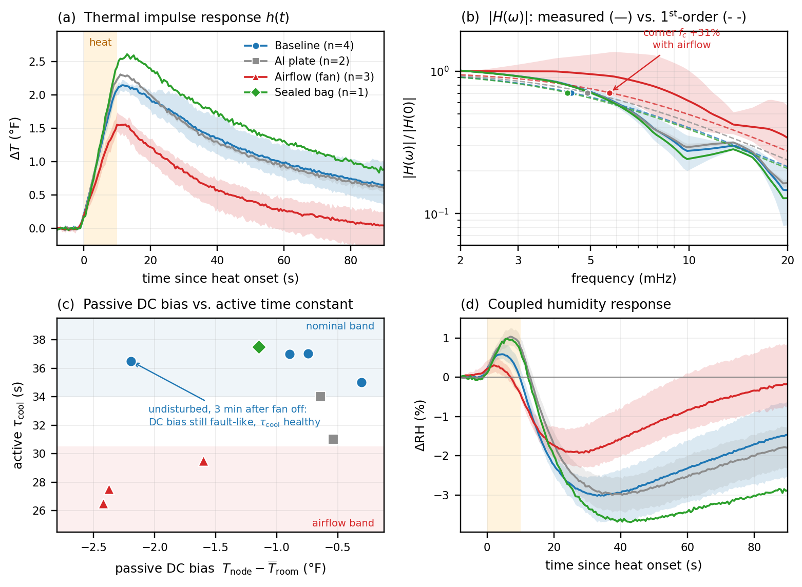

# Preliminary Data: Active Thermal Interrogation for Sensor-Integrity Verification

Draft narrative and figure for inclusion in the proposal. Figure source:
`scripts/make_proposal_figures.py`; data in `data/heater-manual/` and `data/lab-pi/`.

---

## 1. The problem this data motivates

A distributed environmental-sensor network reports numbers continuously, but it has no
built-in way to tell whether those numbers still mean what they are supposed to mean. A
node whose sensor has been shadowed by a leaf, wrapped in condensation, blocked by a
displaced enclosure, or parked in the exhaust of an HVAC diffuser keeps reporting
plausible temperature and humidity. Nothing in the passive data stream announces that the
node has stopped sampling the environment it was deployed to characterize.

The standard defense is *passive cross-comparison*: flag a node whose reading drifts away
from its neighbors. Our preliminary data shows this is necessary but badly insufficient.
It misses real faults, it raises false alarms, and it is slow. We therefore propose
*active interrogation*: each node periodically injects a small, known thermal impulse and
measures its own dynamic response. The response is a fingerprint of the node's coupling to
its surroundings, and that coupling — not the DC reading — is what a physical fault
actually changes.

## 2. Experimental approach

A Raspberry Pi Pico W node (`Byrne417_10`) carrying an AHT20 temperature/humidity sensor
was instrumented with a resistive heater driven by an external 6 V supply. Each trial
recorded a 2 Hz time series through a ~20 s quiescent baseline, a 10 s heat pulse, and a
~110 s relaxation. Five additional identical nodes (`Byrne417_01`–`05`), 3 m away in the
same room, ran undisturbed throughout and provide the passive room reference. Those five
nodes post every 60–80 s, so each 120 s window holds only one to three samples per node;
across all ten reported runs the largest change any reference node showed inside a window
was 0.20 °F, an order of magnitude below the ~2 °F pulse response. Every perturbation we
imposed was therefore local to the test node.

We extracted the temperature rise time constant \(\tau_{\rm heat}\), the relaxation time
constant \(\tau_{\rm cool}\) (36.8 % decay from peak toward the late asymptote), the peak
excursion \(\Delta T_{\rm peak}\), the coupled humidity dip, and the frequency response
\(H(\omega)\), obtained by regularized deconvolution of the known rectangular pulse:
\(H = Y U^{*}/(|U|^{2}+\varepsilon)\).

Two caveats on the estimators. \(\tau_{\rm cool}\) is referenced to the level reached at
the end of the 120 s record rather than a true asymptote; with only about three time
constants of relaxation available this biases \(\tau_{\rm cool}\) low, and the bias grows
with \(\tau\), so every between-condition difference below is a lower bound. And the
quoted corner frequency is not independent evidence: the single-pole fits return
\(f_c = 1/(2\pi\tau_{\rm cool})\) to within rounding, so a percentage shift in \(f_c\)
restates the shift in \(\tau_{\rm cool}\).

Runs are admitted by one criterion fixed before any condition was compared: the heat onset
must fall between 10 and 14 s, which guarantees at least 10 s of quiet pre-pulse baseline
and a full relaxation inside the record. Ten of fourteen records pass (see *Reproducing*).

Four conditions were tested, each an idealization of a realistic field fault:

| Condition | Physical analogue | Runs |
|---|---|---|
| Baseline | healthy, undisturbed node | 4 |
| Aluminum plate suspended above the sensor (not touching) | partial obstruction, leaf or debris shadow | 2 |
| Fan directed only at the test node | unintended forced convection, HVAC or draft | 3 |
| Sensor and heater sealed in a plastic bag | complete obstruction, enclosure or condensation failure | 1 |

## 3. Results

**Table 1.** Mean ± s.d. across keeper runs. DC bias is the node reading minus the
five-node room mean at the same instant.

| Condition | n | ΔT_peak (°F) | τ_heat (s) | τ_cool (s) | f_c (mHz) | ΔRH dip (%) | DC bias T (°F) | DC bias RH (%) |
|---|---|---|---|---|---|---|---|---|
| Baseline | 4 | 2.16 ± 0.07 | 6.3 ± 0.6 | 36.4 ± 0.9 | 4.38 | −3.05 ± 0.49 | −1.03 ± 0.81 | +3.51 ± 1.79 |
| Al plate | 2 | 2.32 ± 0.01 | 6.5 ± 0.0 | 32.5 ± 2.1 | 4.91 | −3.01 ± 0.61 | −0.59 ± 0.07 | +2.82 ± 0.66 |
| Fan | 3 | 1.61 ± 0.15 | 6.3 ± 1.3 | 27.8 ± 1.5 | 5.73 | −1.97 ± 0.54 | −2.13 ± 0.46 | +5.64 ± 1.16 |
| Sealed bag | 1 | 2.61 | 7.0 | 37.5 | 4.24 | −3.69 | −1.15 | +4.20 |

**The baseline is reproducible.** Four undisturbed runs spread over an hour gave
τ_cool = 36.4 ± 0.9 s (2.6 % coefficient of variation) and ΔT_peak = 2.16 ± 0.07 °F. The
measurement is stable enough that a several-second shift in τ_cool is a real signal, not
run-to-run noise. This is the enabling result: an unmodified low-cost node with a
sub-dollar heater resolves its own thermal time constant to a few percent.

**Forced airflow changes the dynamics decisively.** With the fan on, the node dumps heat
faster and stores less of it: τ_cool falls 23.5 % to 27.8 ± 1.5 s and ΔT_peak falls 25.6 %
to 1.61 ± 0.15 °F. With three fan runs against four baseline runs, the informative
statement is the ordering, not a *p*-value: every fan run is faster and weaker than every
baseline run, on both measures. Complete separation of a 3-vs-4 split arises by chance with
probability 1/35 under the null, so this is suggestive on its own and convincing only
alongside the physical mechanism. Any Welch *t* or Cohen's *d* computed at this sample size
is dominated by the sample-size correction and is not reported.

Notably τ_heat is unchanged (6.3 s both cases) — the sensor's own response speed is intact,
so this is a change in *environmental coupling*, not sensor degradation. A passive scheme
sees only that the node reads cold and wet; the active probe identifies the mechanism.

**Complete obstruction produces the opposite, equally distinctive signature.** The bagged
node trapped heat: ΔT_peak rose 21 % to 2.61 °F and the humidity dip deepened to −3.7 %,
while τ_cool stayed close to baseline (37.5 s against a baseline range of 35.0–37.0 s, a
margin of one sample interval). Gain up with timescale roughly unchanged is the opposite
arrangement from gain down with timescale shortened, so the two-dimensional (gain, τ)
response appears to carry fault-*type* information that no scalar DC residual can express.
This rests on a single bagged run and needs replication before it can be relied on.

**Passive DC comparison alone both misses and misfires.** Figure 1c plots each run in the
plane of passive DC bias against active τ_cool. The compact statement is a comparison of
ranges. Taking the four baseline runs as the observed healthy range on each axis, four of
the six fault runs fall *inside* the healthy DC-bias range, while all six fall *outside*
the healthy ΔT_peak range and outside the healthy τ_cool range. The healthy ranges here are
empirical spans of four runs, not calibrated thresholds, but the contrast between the two
channels does not depend on where the thresholds are eventually set.

Two failure modes of the passive-only approach are visible individually. First, the
aluminum plate — a genuine partial obstruction — produced a DC bias of −0.59 °F, *smaller*
than the healthy baseline's own spread (−1.03 ± 0.81 °F). A neighbor-comparison monitor
would call it clean. Its τ_cool, however, dropped 10.7 % to 32.5 ± 2.1 s, with every Al run
faster than every baseline run. Second, and more sharply:
a genuinely undisturbed baseline run taken three minutes after the fan was switched off
still carried a fully fault-like DC bias of −2.19 °F, because the node's thermal mass and
the local humidity had not re-equilibrated. Its τ_cool, measured in the same 130 s window,
had already returned to a healthy 36.5 s. **The passive statistic was still reporting a
fault that no longer existed; the active probe correctly reported recovery.** Active
interrogation both detects faults the passive channel misses and clears them faster once
they are gone.

**Frequency-domain view.** Figure 1b shows \(|H(\omega)|\) normalized to its DC value with
single-pole fits overlaid. Baseline, Al, and bag conditions collapse onto nearly the same
low-pass curve; the fan condition is separated across the whole 3–20 mHz band. Because the
fits are single-pole, this panel restates the time-domain result rather than adding to it;
its value is the goodness of fit. The first-order model tracks the measured response well
up to roughly the corner, which supports treating the node as a single dominant thermal
pole and justifies compressing each interrogation to a few transmitted parameters rather
than a full waveform. Above the corner the deconvolution is estimating a ratio of two small
numbers, so the high-frequency end of each curve should not be read as measurement. That is
also the current limitation: a single 10 s rectangular pulse concentrates its energy below
~15 mHz, so the band where partial obstructions might be most separable is exactly where
our present excitation is weakest.

## 4. What the preliminary data establishes, and what it motivates

Established:

1. A commodity node can measure its own thermal transfer function in situ, repeatably, with
   a heater costing under a dollar and no additional sensors.
2. Realistic fault modes produce large, systematic, physically interpretable changes in that
   transfer function — 24 % in τ_cool and 26 % in gain for airflow, 21 % in gain for full
   obstruction.
3. Distinct fault modes fell in distinct regions of the (gain, τ) plane. With two, three,
   and one run in the three fault conditions this is consistent with fault-*type*
   information but does not demonstrate classification; it is the hypothesis the fleet
   study is designed to test.
4. Passive neighbor comparison, the current state of practice, both misses a real
   obstruction and false-alarms on a recovered node, in the same small data set.

Motivated by the gaps this data exposes:

- **Richer excitation.** The partial-obstruction case (Al plate) is the weakest of the
  three: both runs land outside the baseline range on both axes, but two runs cannot rule
  out coincidence, and the effect is a third the size of the airflow effect. Chirp or PRBS
  excitation would place energy across 1–100 mHz and
  estimate \(H(\omega)\) over a decade of bandwidth in comparable measurement time,
  which is the natural route to separating partial obstructions.
- **Larger n and a real fault library.** The present study is 10 runs on one node. Scaling
  to a fleet with repeated, scheduled self-interrogation is what turns these effect sizes
  into calibrated detection thresholds and per-node baselines that track seasonal drift.
- **Joint passive-plus-active inference.** Neither channel alone is sufficient, and
  Figure 1c shows they fail in *different* directions. The combined statistic is the
  proposed detector.
- **Energy and duty-cycle budget.** These runs were driven from a bench supply and neither
  heater current nor resistance was logged, so no power or energy figure can be quoted from
  them. Measuring the per-test energy on the node-powered drive, and setting how often
  interrogation must run to bound undetected-fault time, is outstanding work.

---

## Figure



**Figure 1. Active thermal interrogation separates sensor-integrity faults that passive
neighbor comparison cannot.** A Pico W node with an AHT20 sensor and a resistive heater
receives a 10 s heat pulse (shaded) while five identical nodes 3 m away provide an
undisturbed room reference. (a) Measured thermal impulse response; lines are condition
means, bands are run-to-run range. Forced airflow suppresses and shortens the response;
sealing the node in a bag amplifies it. (b) Frequency response \(|H(\omega)|\) from
regularized deconvolution of the known pulse (solid) with single-pole fits (dashed) and
corner frequencies (markers); airflow shifts the corner from 4.4 to 5.7 mHz. (c) Each run
in the plane of passive DC bias versus actively measured τ_cool. The aluminum-plate
obstruction is invisible to the passive axis but separated on the active axis, and an
undisturbed run taken 3 min after the fan stopped retains a fault-like DC bias while its
time constant has already recovered. (d) Coupled humidity response, showing the reduced
dip under forced airflow and the deepened dip under full obstruction.

---

## Reproducing

```bash
python3 scripts/make_proposal_figures.py
```

Writes `docs/proposal/figures/fig_preliminary_impulse.{png,pdf}` and
`docs/proposal/figures/table_preliminary_stats.csv`. Per-run values, including UTC
timestamps and interpolated room-reference conditions, are in
`data/heater-manual/preliminary_keepers_summary.csv`.

Excluded runs, all by the 10–14 s heat-onset gate and no other criterion: `Al_r3` (onset
19.5 s), `Al_r4` (4.0 s), `fan_r1` (2.5 s), `baseline_6V_r4` (6.5 s). Two further records
(`airflow_fan_r2` at 21:17:46, `obstruction_Al_r2` at 20:42:13) are aborted retries that
contain no usable series. The run originally logged as `baseline_6V_r6` is the sealed-bag
trial and is reported as `bag_r1`.

The proposal repository carries an independent re-implementation of the estimators
(`proposal/figures/regen_probe_fig.py` in `usda-nifa-uie-proposal`, reading a copy of these
records). It reproduces the values above within 0.01 °F and 0.1 s, and applies the same
onset gate to the same fourteen candidates with the same four exclusions.
